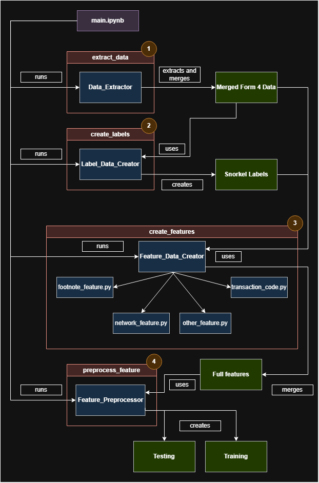

# DSA4263 Suspicious insider trading detection

# Overview

Insider trading involves buying or selling securities using non-public, confidential information, which is illegal and fraudulent. Despite this, the potential for high profits tempts many to take the risk in hopes of quick wealth. This practice harms retail investors, who are usually at a disadvantage in such transactions as they do not have access to private information. Therefore, this project aims to detect potential insider trading as soon as related SEC filings are submitted.

# Quick start

Follow these steps to set up the project on your computer

**Note: The python version requirement is Python>=3.11**

## Install project folder

- **Step 1: Clone this repository to your local**

```{bash}
git clone https://github.com/Blimperoo/DSA4263-Final-Insider-Trading.git
```

- **Step 2: Navigate to the root of the project directory**

```{bash}
cd DSA4263-Final-Insider-Trading
```

- **Step 3: Install required dependencies**

```{bash}
pip install -r requirements.txt
```

- **Step 4: Create `data_untracked` folder by running the bash code in the root directory of the git repository.**

```{bash}
mkdir -p data_untracked/raw/sec_submissions/interim \
         data_untracked/raw/sec_submissions/compiled \
         data_untracked/raw/abnormal_returns/crsp \
         data_untracked/raw/abnormal_returns/fred \
         data_untracked/raw/abnormal_returns/trans_ars \
         data_untracked/raw/profile_data \
         data_untracked/processed \
         data_untracked/features
 ```

 - **Step 5: Download datasets from the Google Drive Link below**

    ### [Google Drive Link](https://drive.google.com/drive/folders/1P7Po6sqYv-sSNNJVjQm-1BEYM_8LSBmX) 
    
# Datasets
As the dataset is too large for github to handle, this project's data is linked to a public [Google Drive](https://drive.google.com/drive/folders/1P7Po6sqYv-sSNNJVjQm-1BEYM_8LSBmX). It is recommended that the relevant datasets are downloaded to the corresponding `data_untracked` folder to minimize time scraping and creating the data. 

## Dataset folder structure (`data_untracked`)

```
         data_untracked/
         ├── raw/
         │   ├── sec_submissions/
         │   │   ├── interim/                          # Raw Form 4 filings (zipped), 2005–2024
         │   │   │   ├── 2015q1_form345.zip
         │   │   │   ├── ...
         │   │   │   └── 2024q4_form345.zip
         │   │   └── compiled/                         # Compiled SEC submission data
         │   │       ├── NONDERIV_TRANS.csv
         │   │       ├── NONDERIV_HOLDING.csv
         │   │       ├── REPORTINGOWNER.csv
         │   │       ├── DERIV_HOLDING.csv
         │   │       ├── DERIV_TRANS.csv
         │   │       ├── SUBMISSION.csv
         │   │       └── FOOTNOTES.csv
         |   |
         │   ├── abnormal_returns/
         │   │   ├── crsp/
         │   │   │   ├── daily_stock_data_by_ticker/   # Daily stock prices split by ticker
         │   │   │   │   ├── AAPL.csv
         │   │   │   │   ├── MSFT.csv
         │   │   │   │   └── ...
         │   │   │   └── split_csv_parts/             # Batched beta calculation data
         │   │   │       ├── part_1.csv
         │   │   │       ├── ...
         │   │   │       └── part_5.csv
         │   │   ├── fred/
         │   │   │   └── risk_free_rate_daily.csv      # FRED risk-free rate data
         │   │   └── trans_ars/                        
         │   │       └── ...                           # Abnormal return calculations will be generated here (batched)
         │   |
         │   └── profile_data/
         │       ├── adjacency_list.csv                 # Adjacency list of the network   
         │       ├── congress_date_subcomm_mapper.pkl           
         │       ├── house_membership_by_date.pkl       # Maps dates to a list of active House member nodeIDs
         │       ├── tic_to_subcomm_mapper.pkl          # Maps each company’s TIC to a set of subcommittee names
         │       ├── TIC to SIC.xlsx                    # Generates dictionary that stores the relevant subcommittees for each company
         │       ├── house.csv                          # Contains member's name, congress member's internal ID, start & end date and subcommittee name
         │       ├── full_features.csv                  # Stores the list of transactions without ids
         │       ├── mapping_CIK2Node_txn_dict.pkl      # txns_for_features.csv in pickle format
         │       ├── congress_matches_7apr_603pm.csv    # Contains member's name and littlesis nodeid
         │       ├── senate_ass.csv                     # Generates congress_date_subcomm_mapper dictionary
         │       ├── manual_fill.csv                    # Contains manual corrections
         │       ├── entities_merged.csv                # Littlesis data
         │       ├── all_matched_bioguide.csv           # csv version of congress_nodeid_mapper.pkl
         │       ├── congress_nodeid_mapper.pkl         # Bioguide matching
         │       ├── sen_tic_to_subcomm_mapper.pkl      # Ticker to Senate committee mapping
         │       ├── house_date_subcomm_mapper.pkl      # Maps each House subcommittee name to its membership timeline
         │       ├── senate_date_subcomm_mapper.pkl     # Maps each Senate subcommittee name to its membership timeline
         │       └── senate_membership_by_date.pkl      # Maps dates to a list of active Senate member nodeIDs
         │
         ├── processed/
         │   ├── transactions_final.csv                                # Merged transaction data from SEC Form 4 (3546490, 24)
         │   ├── transactions_abnormal_returns.csv                     # Transactions with calculated abnormal returns (3171001, 46)
         │   ├── transactions_abnormal_returns_anomaly_score.csv       # Adds anomaly score partial labels (3171001, 83)
         │   ├── merged_txns_SNORKEL.csv                               # Adds labels from Snorkel labeling functions
         │   ├── merged_relationships_full.csv                         # Network data
         │   ├── ground_truth_matching_keys.csv                        # Ground truth transactions caught and flagged by SEC
         │   ├── final_final_name_match.csv                            # Stores the [“SEC_RPTOWNERCIK”, “id”]
         │   ├── full_features.csv                                     # Data after feature creation
         │   ├── training_full_features.csv                            # Training data for challengers
         │   ├── testing_full_features.csv                             # Testing data for 
         │   ├── training_full_features_baseline.csv                   # Training data for baseline
         │   └── testing_full_features_baseline                        # Testing data for baseline
         │
         │
         ├── features/                                                 # Folder that stores all the Key-Feature files
         │   ├── footnote_word_count_feature.csv
         │   ├── other_feature.csv
         │   ├── network_features.csv
         │   ├── network_time_dep_feature.csv
         │   ├── network_time_ind_feature.csv
         │   ├── pagerank_feature.csv
         │   └── graph_feature.csv

```
# Code
The code structure to create datais split into 4 main responsibilities
* extract
  * Data_Extractor: Extracts and merges form 4 data

* labels 
  * Data_Label_Creator: Creates snorkel labels

* features
  * Feature_Data_Creator: Creates and merges features
    * footnote_feature.py
    * network_feature.py
    * other_feature.py
    * transaction_code.py

* preprocess
  * Feature_Preprocessor: preprocesses data into train and testing

## Code sequence diagram



## Code folder structure (`src`)

```
         src/
         ├── path_location/
         │   └── folder_location.py/                # Script contains path for folders and csv in data untracked 
         │
         ├── extract_data/
         │   └── extract.py/                        # Script to extract SEC form 4 contents
         │
         ├── create_labels/
         │   └── labels.py/                         # Contains class to create labels for data
         │
         ├── create_features/                       # Folder that involves creating features, labels and preprocessing 
         │   ├── features.py                        # Contains class to create all features  
         │   ├── footnote_feature.py                # Feature - footnote
         │   ├── graph_feature.py                   # Feature - graph
         │   ├── network_feature.py                 # Feature - network
         │   ├── other_feature.py                   # Feature - other transactions
         │   ├── pagerank_feature.py                # Feature - pagerank
         │   └── transaction_code_feature.py        # Feature - transaction code
         │
         ├── preprocess_feature/
         │   └── preprocess.py/                     # Contains class to preprocesses features to be useable and create training testing
         │
         ├── notebook_references/                              # Folder to see steps on how labels are created
         │   ├── create_labels_1_abnormal_returns.ipynb        
         │   ├── create_labels_2_anomaly_scores.ipynb          
         │   ├── create_labels_3_snorkel_labelling.ipynb       
         │   └── create_network_helper_1_time_dep.ipynb
         │ 
         ├── main/
         │   └── main.ipynb                         # Run this main file
```


# Contributors:
* Caitlyn Kua
* Darryl Chan
* Emily Ng
* Lewis Chong
* Megan Lee

# License
